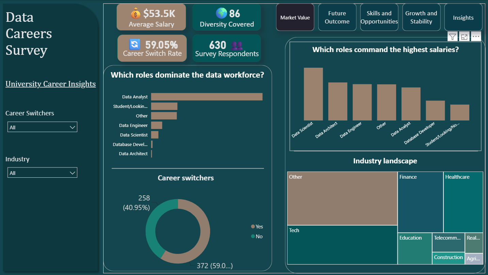
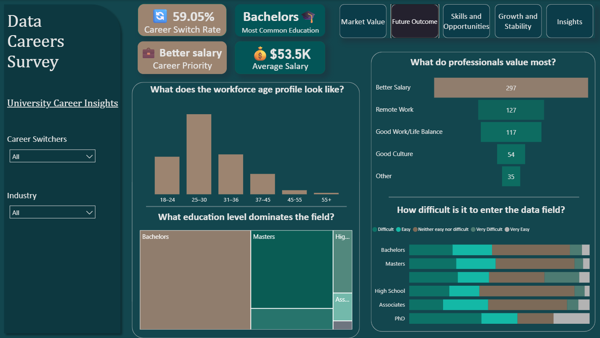
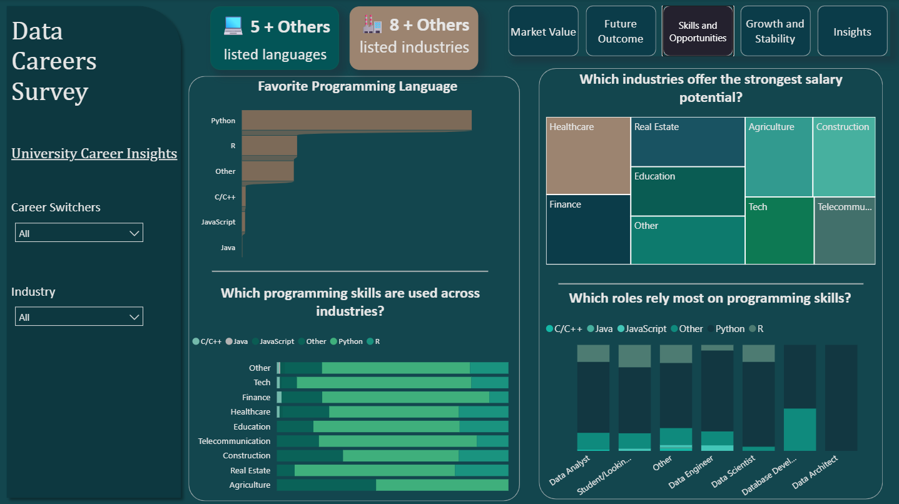
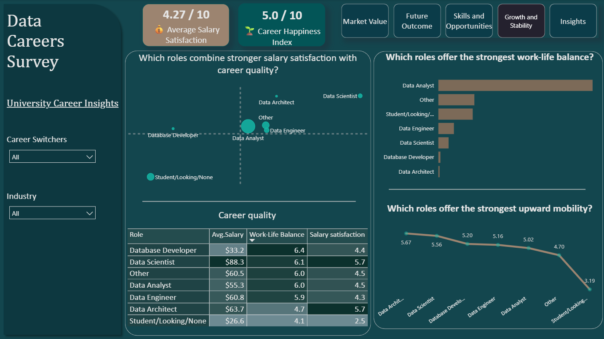
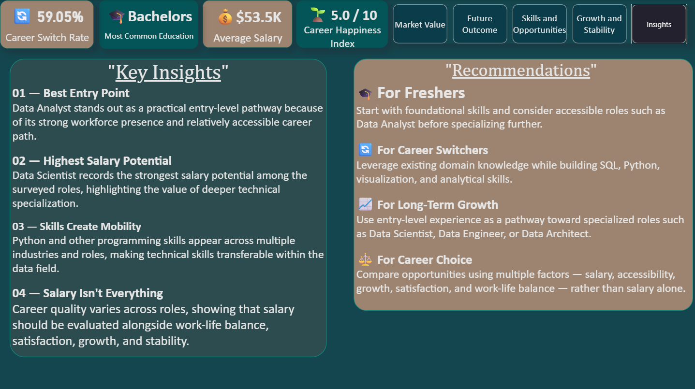

# Data Careers Survey — University Career Insights

An interactive Power BI project analyzing survey data on the data-career landscape — career expectations, required skills, and long-term opportunities — to evaluate the case for a university introducing a Data Analytics department.

---

## 📸 Project Preview

### Market Value

### Future Outcome

### Skills & Opportunities

### Growth & Stability

### Insights

---

## 🎯 Project Objective

A university surveyed **630 respondents** across **86 diversities** to understand career opportunities, skills, expectations, and preferences within the data field.

The objective was to transform those responses into insights that could help the university evaluate the potential value of launching a Data Analytics program — and to give students and career switchers a clearer, evidence-based view of the field.

The analysis focuses on:
- Understanding the current data-career landscape
- Identifying common data roles and industries
- Comparing salary potential across roles and industries
- Understanding career accessibility for career switchers
- Identifying important programming and technical skills
- Evaluating career growth, satisfaction, and work-life balance
- Providing recommendations for students, career switchers, and the university

---

## 📊 Key Questions

- Which roles dominate the data workforce?
- Which roles command the highest salaries?
- How accessible is the data field for career switchers?
- What education level is most common among professionals?
- Which programming languages are most widely used?
- Which industries offer strong salary potential?
- Which roles provide better work-life balance?
- Which roles show stronger career growth potential?
- What factors do professionals value most in their careers?

---

## 🧹 Data Cleaning & Transformation

The raw survey export wasn't analysis-ready — free-text fields, inconsistent categories, and mixed formats needed to be resolved before any reliable comparison was possible.

**Key challenges and how they were handled:**
- **Salary data** was entered as free text with mixed currencies, ranges, and typos → parsed and standardized into a single numeric field so roles and industries could be compared on equal terms.
- **Country data** was split across a dropdown field and a manual "Other" text field → merged into one clean, consistent country column.
- **Role and industry labels** had overlapping/inconsistent naming (e.g. "Data Analyst" vs "Analyst") → standardized into a fixed set of categories.
- **Low-frequency countries and industries** were grouped into an **Other** bucket to avoid noisy, unreadable charts.
- Calculated fields and DAX measures were built to support interactive filtering across all five report pages.

---

## 🛠️ Tools Used

- **Power BI** — data analysis, visualization, and interactive reporting
- **Power Query** — data cleaning and transformation
- **DAX** — measures and calculated metrics
- **Data Visualization** — interactive storytelling and insight presentation

---

## 🔍 Exploratory Analysis

Explored relationships between:
- Job roles and salary
- Education and career accessibility
- Roles and work-life balance
- Roles and salary satisfaction
- Programming languages and industries
- Programming skills and job roles
- Career switching and entry into the data field
- Career roles and upward mobility

---

## 📈 Key Insights

### 1. Data Analyst is the Most Accessible Entry Point
Data Analyst represents **60.48%** of surveyed roles — by far the largest share of the workforce — making it the most practical entry point into the data field for freshers and career switchers alike.

### 2. Data Scientist Shows the Strongest Salary Potential
Data Scientist reports the highest average salary among surveyed roles at **$88.3K**, compared to **$55.3K** for Data Analyst — roughly a **60% premium** that reflects the value of deeper technical specialization.

### 3. Python is the Connective Tissue of the Field
Python is used by **66.67%** of respondents, making it the clear leader among programming languages and the single most transferable technical skill across every industry and role surveyed.

### 4. Salary Isn't Everything
Database Developer scores highest on work-life balance (**6.4/10**) despite ranking near the **bottom** on salary ($33.2K) — while higher earners like Data Engineer and Data Architect report *lower* satisfaction. Career quality is clearly multidimensional, not just a function of pay.

---

## 💡 Recommendations

### For Freshers
- Build strong foundational skills in SQL, Python, data visualization, and analytics.
- Consider accessible entry-level roles such as Data Analyst.
- Gain practical experience through projects and real-world datasets.
- Explore different data roles before specializing.

### For Career Switchers
- Leverage existing domain knowledge when entering the data field.
- Develop transferable technical and analytical skills.
- Focus on SQL, Python, visualization, and problem-solving.
- Build practical projects to demonstrate job readiness.

### For Long-Term Growth
Use entry-level experience as a pathway toward specialized roles such as:
- Data Scientist
- Data Engineer
- Data Architect

### For the University
A potential Data Analytics program should combine:
- Technical training
- Practical projects
- Data visualization
- Analytical problem-solving
- Career-readiness skills
- Exposure to multiple data-career pathways

---

## 📁 Files

> **Note:** GitHub can't preview `.pbix` files inline — download it and open in Power BI Desktop to explore the report interactively.

- [Data_Careers_Survey.pbix](./Data_Careers_Survey.pbix) — Power BI project file
- [Market_value.png](./Market_value.png) — Market Value screenshot
- [Future_outcomes.png](./Future_outcomes.png) — Future Outcome screenshot
- [Skills_and_opportunities.png](./Skills_and_opportunities.png) — Skills & Opportunities screenshot
- [Growth_and_stability.png](./Growth_and_stability.png) — Growth & Stability screenshot
- [Insights.png](./Insights.png) — Insights screenshot

---

## 🚀 Project Outcome

This project demonstrates how raw survey data can be transformed into structured, decision-ready career insights through data cleaning, transformation, DAX-driven analysis, and business-oriented visual storytelling.

---

## 👩‍💻 Author

**Chhavi**
Data Analytics | Power BI | SQL | Excel | Tableau | Python

[GitHub](https://github.com/chhavi-tech12)

